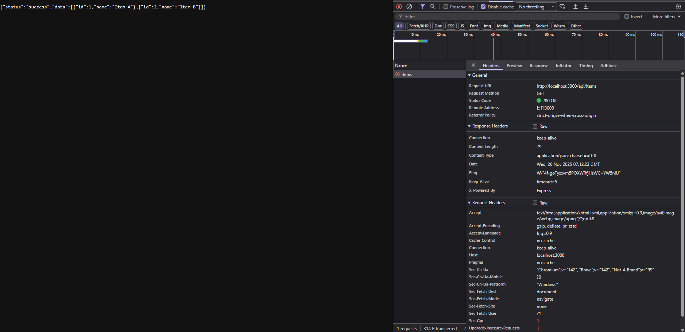
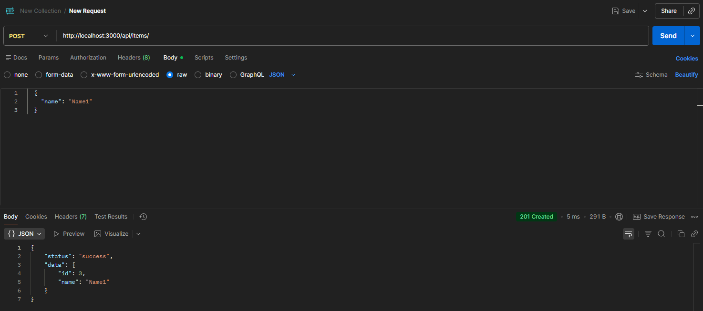
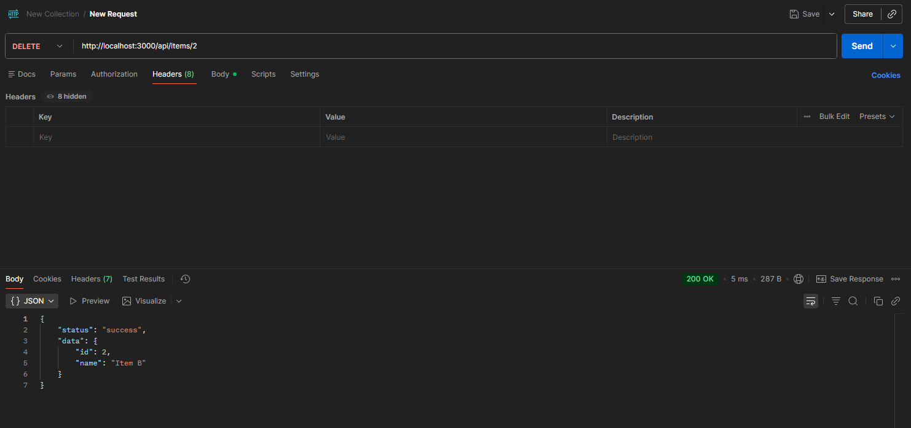

# Web Design Practice 2

Pratice for Web design class in JBNU Computer Science department 

### Prerequisites
- Node.js

### Quick start
1. Clone the repo
2. Install dependencies
    - npm install
3. Run in development
    - npm run start

### Examples of tests

